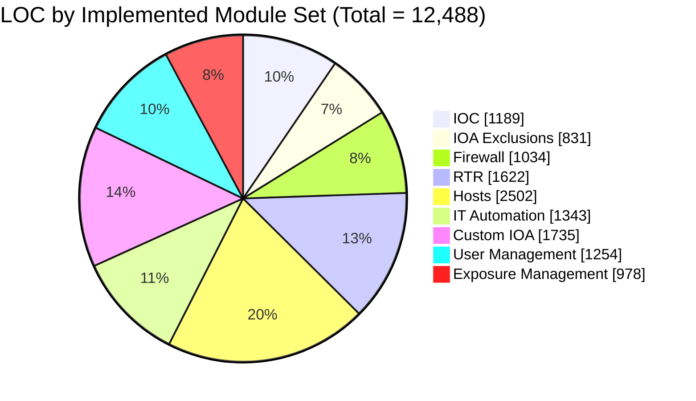
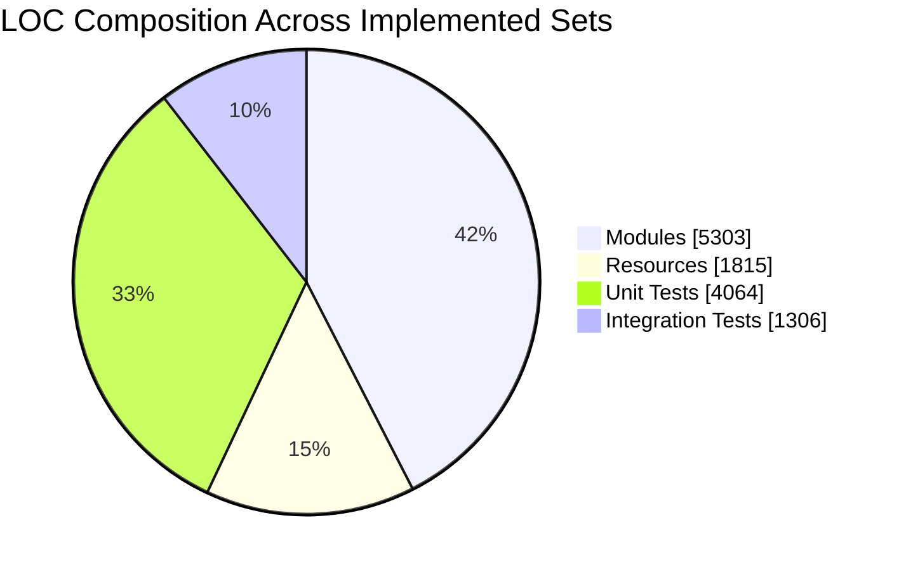
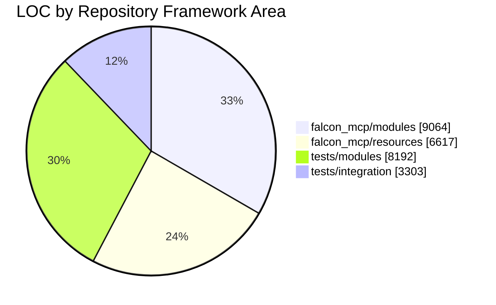

# Falcon MCP Module Summary (Presentation)

**Snapshot Date:** March 10, 2026  
**Branch / Commit:** `main` @ `e3ff8f5`  
**LOC Method:** `git ls-files` + `wc -l` (tracked files only)

## Repository Totals

| Metric | Value |
|---|---:|
| Tracked files | 175 |
| Python files | 134 |
| Python LOC (all tracked `.py`) | 35,849 |

## Framework Totals by Area

| Area | Files | LOC |
|---|---:|---:|
| `falcon_mcp/modules` | 22 | 9,064 |
| `falcon_mcp/resources` | 19 | 6,617 |
| `tests/modules` | 23 | 8,192 |
| `tests/integration` | 24 | 3,303 |

## Module Coverage Summary (Implemented Sets)

| Module Set | Module LOC | Resource LOC | Unit Test LOC | Integration LOC | Total LOC |
|---|---:|---:|---:|---:|---:|
| IOC | 383 | 126 | 461 | 219 | 1,189 |
| IOA Exclusions | 372 | 103 | 304 | 52 | 831 |
| Firewall | 408 | 89 | 375 | 162 | 1,034 |
| Real Time Response (RTR) | 843 | 249 | 434 | 96 | 1,622 |
| Hosts (Host Group / Migration / Hosts) | 952 | 782 | 595 | 173 | 2,502 |
| IT Automation (Phase 3) | 681 | 128 | 409 | 125 | 1,343 |
| Custom IOA | 618 | 129 | 768 | 220 | 1,735 |
| User Management | 585 | 127 | 415 | 127 | 1,254 |
| Exposure Management | 461 | 82 | 303 | 132 | 978 |
| **Implemented Set Total** | 5,303 | 1,815 | 4,064 | 1,306 | **12,488** |

## Presentation Charts

### Implemented Set LOC Distribution

### Implemented Set Composition (Code vs Tests)

### Framework Area LOC Distribution

## File-Level LOC for Implemented Sets

### IOC

| File | LOC |
|---|---:|
| `falcon_mcp/modules/ioc.py` | 383 |
| `falcon_mcp/resources/ioc.py` | 126 |
| `tests/modules/test_ioc.py` | 461 |
| `tests/integration/test_ioc.py` | 219 |

### IOA Exclusions

| File | LOC |
|---|---:|
| `falcon_mcp/modules/ioa_exclusions.py` | 372 |
| `falcon_mcp/resources/ioa_exclusions.py` | 103 |
| `tests/modules/test_ioa_exclusions.py` | 304 |
| `tests/integration/test_ioa_exclusions.py` | 52 |

### Firewall

| File | LOC |
|---|---:|
| `falcon_mcp/modules/firewall.py` | 408 |
| `falcon_mcp/resources/firewall.py` | 89 |
| `tests/modules/test_firewall.py` | 375 |
| `tests/integration/test_firewall.py` | 162 |

### Real Time Response (RTR)

| File | LOC |
|---|---:|
| `falcon_mcp/modules/rtr.py` | 843 |
| `falcon_mcp/resources/rtr.py` | 249 |
| `tests/modules/test_rtr.py` | 434 |
| `tests/integration/test_rtr.py` | 96 |

### Hosts (Host Group / Migration / Hosts)

| File | LOC |
|---|---:|
| `falcon_mcp/modules/hosts.py` | 952 |
| `falcon_mcp/resources/hosts.py` | 782 |
| `tests/modules/test_hosts.py` | 595 |
| `tests/integration/test_hosts.py` | 173 |

### IT Automation (Phase 3)

| File | LOC |
|---|---:|
| `falcon_mcp/modules/it_automation.py` | 681 |
| `falcon_mcp/resources/it_automation.py` | 128 |
| `tests/modules/test_it_automation.py` | 409 |
| `tests/integration/test_it_automation.py` | 125 |

### Custom IOA

| File | LOC |
|---|---:|
| `falcon_mcp/modules/custom_ioa.py` | 618 |
| `falcon_mcp/resources/custom_ioa.py` | 129 |
| `tests/modules/test_custom_ioa.py` | 768 |
| `tests/integration/test_custom_ioa.py` | 220 |

### User Management

| File | LOC |
|---|---:|
| `falcon_mcp/modules/user_management.py` | 585 |
| `falcon_mcp/resources/user_management.py` | 127 |
| `tests/modules/test_user_management.py` | 415 |
| `tests/integration/test_user_management.py` | 127 |

### Exposure Management

| File | LOC |
|---|---:|
| `falcon_mcp/modules/exposure_management.py` | 461 |
| `falcon_mcp/resources/exposure_management.py` | 82 |
| `tests/modules/test_exposure_management.py` | 303 |
| `tests/integration/test_exposure_management.py` | 132 |
